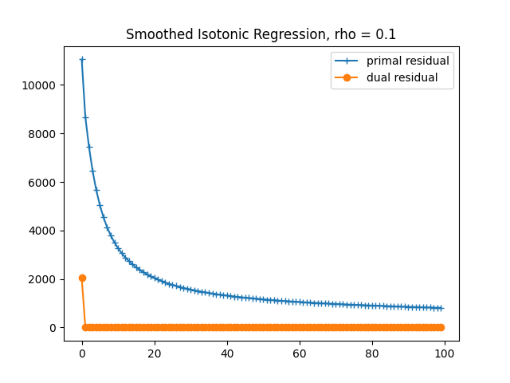

# MbADMM-IRP
Unofficial implementation of "The Application of Multi-block ADMM on Isotonic Regression Problems" paper, https://arxiv.org/abs/1903.01054

# Input arguments
- `n`: number of observations (integer)
- `rho`: penalty parameter (float)
- `num_iters`: number of iterations of the algorithm (integer)
- `problem`: problem of interest (string, `MO` for multi-dimensional ordering or `SIR` for smoothed isotonic regression)
- `exp`: type of the experiment (string, 'residual' for experiment 1 in the paper or 'time' for experiment 2)
- `timesteps`: timestep for runtime experiment
# Execution example
```
python experiments.py --n=1000 --rho=0.1 \
  --problem='SIR' --exp='residual' --num_iters=100
```
output:


